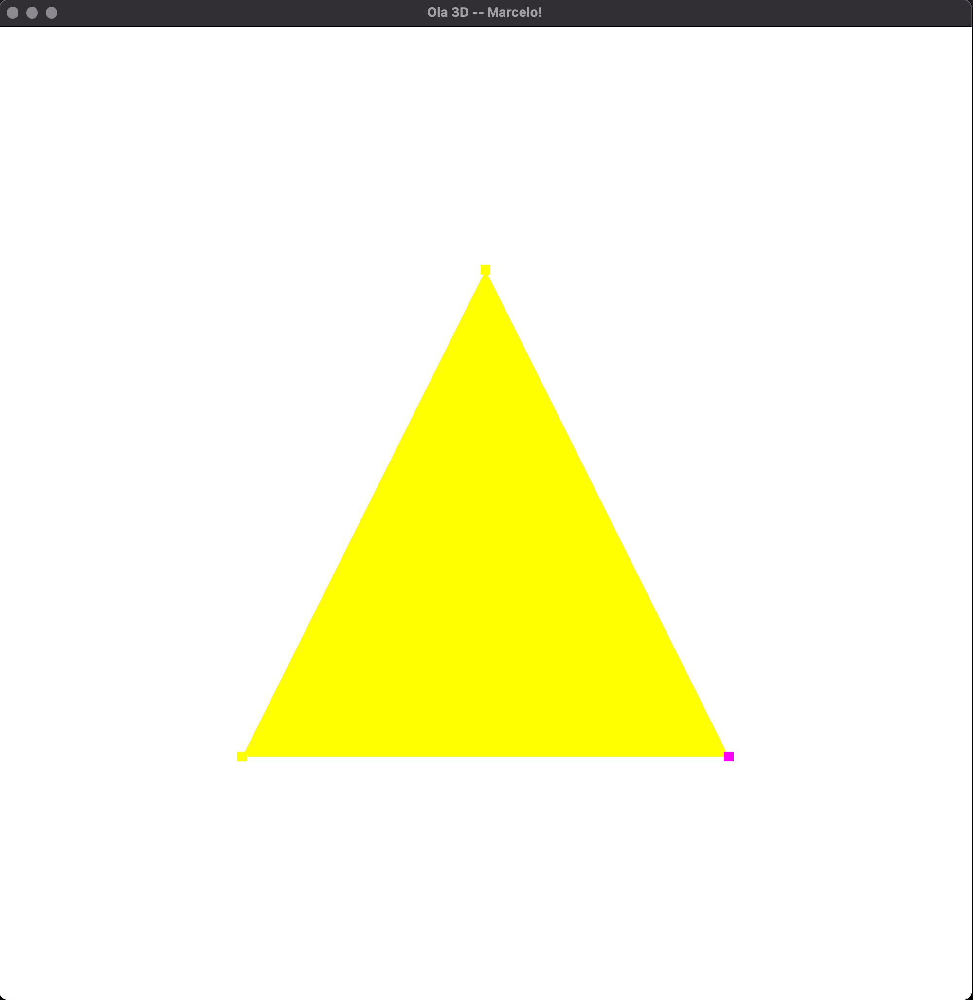
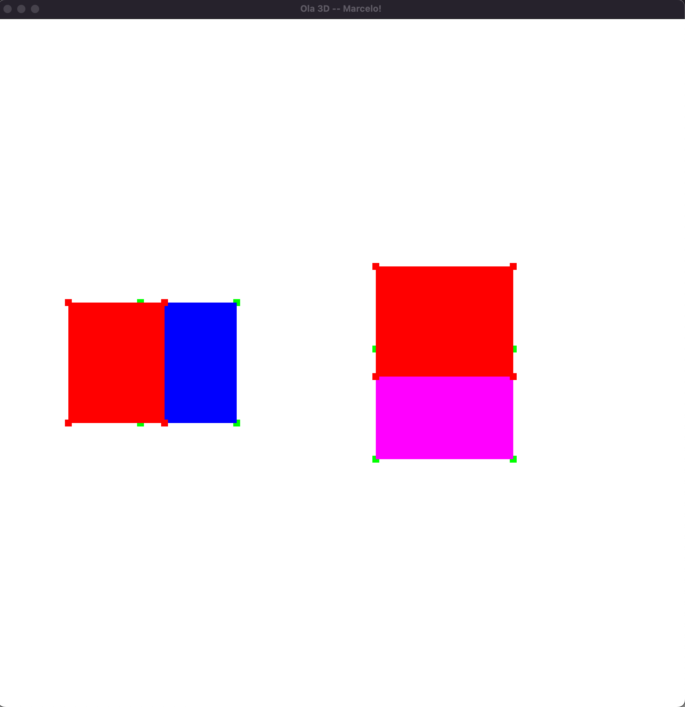

# RESULT

## Execução do Hello3D

Ambiente:

- macOS Monterey 12.7.6
- VS Code
- CMake
- Apple Clang

Janela executada com o título:
`Ola 3D -- Marcelo!`

Print da execução:

## Tarefa - Instanciando objetos na cena 3D

    - Geometria do cubo (6 faces, 12 triângulos, 36 vértices) e uma cor por face
    - Translação via teclado: WASD (X/Z) e I/J (Y)
    - Escala uniforme: [ diminui e ] aumenta
    - Instanciar vários cubos: N cria um novo cubo
    - Trocar cubo ativo: TAB
